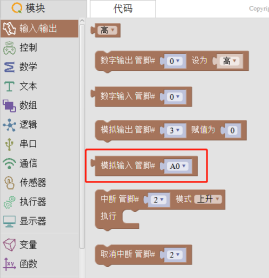
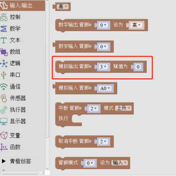
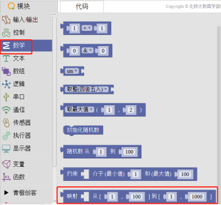
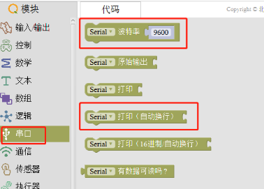
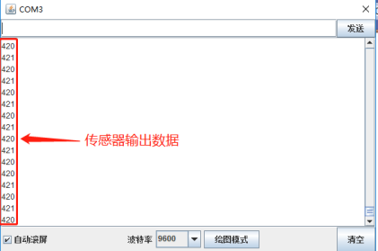

# 模拟量输出类传感器在 Mixly 中使用示例

## 3.2.1 模拟量输出类传感器在 Mixly 中使用示例

本案例中以“旋钮开关控制 LED 灯的亮度”作为示例说明模拟量输出类传感器的使用方法，编程步骤如下：

（1）打开 Mixly 编译环境，在 Mixly 左侧模块栏中选择 输入/输出 →模拟输入，如图 3.2-1。本示例中需要两个模拟输入的模块需要再次选择该模块：

（2）在 Mixly 的左侧模块栏中选择 输入/输出 →模拟输出，如图 3.2-2 所示：

（3）修改模拟输出管脚，根据主控板接入传感器的引脚选择正确的管脚号（本示例中选择接入 D11 管脚），如图 3.2-3所示：

（4）在 Mixly 左侧模块栏中选择 数学→映射，如图 3.2-4 所示，映射的功能是将前面集合中的元素对应到后面集合中的元素，本示例中，映射模块前面集合中的元素为主控制器从传感器采集到的数据（0～1023），后面集合中的数据设置为0～255，0～255 是模拟输出的限定范围，修改模块中的数字，修改完成如图 3.2-5 所示：

（5）在 Mixly 左侧模块栏中分别选择 串口 → Serlai 波特率 和 Serial 打印（自动换行），如图 3.2-6 所示。使用串口打印功能，我们可以通过串口监视器观察传感器采集到的数据。

（6）将以上从模块栏中选择的模块按下图连接好，如图 3.2-7 所示:

（7）将旋钮开关和 LED 灯分别连接到主控板的 A0 端口和 D11 端口，然后将程序上传到主控板，转动旋钮，可观察到LED 灯的亮度随之改变。打开 Mixly 的串口监视器，观察传感器采集到的数据，如图 3.2-8 所示，转动旋钮时，串口监视器显示的数据也会随之改变。其他模拟量输出类传感器与旋钮开关的使用方法相同。

（8）在 Mixly 示例程序文件中打开“模拟输入进行控制 LED”的示例，将此示例上传到主控板后，通过改变模拟量输出类传感器的状态就可以改变 LED 灯的亮度。

