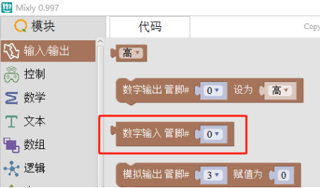
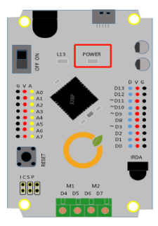
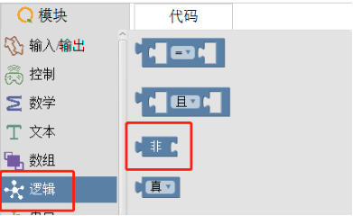

# 数字开关类传感器在 Mixly 中使用示例

## 2.2.1 数字开关类传感器在 Mixly 中使用示例

本案例中以“大按键开关控制 LED 灯的亮灭”作为示例说明数字开关类传感器的使用方法，编程步骤如下：

（1）打开 Mixly 编译环境，在 Mixly 左侧模块栏中选择 输入/输出 →数字输入，如图 2.2-1。

（2）修改数字输入管脚，根据主控板接入传感器的引脚选择正确的管脚号（本示例中选择接入数字 D2 管脚），如图2.2-2 所示。

（3）在 Mixly 左侧模块栏中选择 输入/输出 →数字输出，如图 2.2-3。然后将管脚号改为 13，如图 2.2-4 所示，13 管脚为主控板自带 LED 灯控制管脚，主控板自带 LED 灯如图 2.2-5 所示。

（4）在 Mixly 左侧模块栏中选择 逻辑 → 非，如图 2.2-6。

（5）将以上步骤中已选择的模块按下图连接好，如图 2.2-7 所示

（6）将程序上传到主控板，并连接好大按键开关，当按下按键时，可以观察到主控板上的 LED 灯亮，当释放按键时，LED 灭。其他数字开关类传感器的使用方法与此相同。

（7）在 Mixly 示例程序文件中打开“数字开关控制 LED 灯”示例文件，将此示例上传到主控板后，通过改变数字开关类传感器的状态就可以控制 LED 灯的亮灭。

