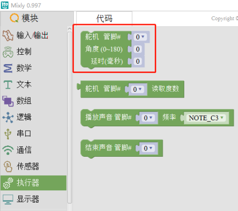
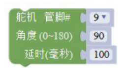
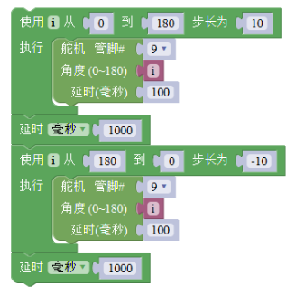

# 舵机

## 5.4.1简介

9g舵机是一种位置伺服的驱动器，适用于角度不断变化并可以保持的控制系统中，转动范围为 0-180 度。舵机的扭力有大小之分，扭力越大，耗电越大，因此需要提供稳定且充裕的电流才能发挥出舵机的高性能，本说明书介绍的是 SG90 舵机\(9g 舵机\)，扭力较小，耗电小，直接连接到主控板即可。舵机的引线中橙色为控制线，红色为电源正极、棕色为电源负极。

注： 固定舵机之前需要为舵机回中，即在安装舵机之前需要设定其角度为 90°（也可根据具体需求设定角度），设置方法可参照下述示例步骤 2，通过程序设置舵机值。

## 5.4.2 舵机在 Mixly 中使用示例

（1）打开 Mixly，在左侧模块栏选择 执行器 →舵机，如图 6.4-1 所示

（2）在程序中，需要根据主控板连接舵机的端口修改程序模块里的管脚号，角度值可设置 0～180 之间的数值，设置延时时间是为了让舵机转动过设定角度后有一段稳定时间，示例中设置管脚为 9，角度为 90，延时时间设置为 100 毫秒（可修改），如图 6.4-2 所示。上传程序到主控板，可观察到舵机角度转到 90°位置。

（3）按照图 6.4-3 所示连接程序，上传程序到主控板，可观察到舵机角度在 0°到 180°之间来回转动，每次转动 10°角。

（4）在 Mixly 示例程序文件中打开“舵机角度控制示例”，上传程序到主控板，可观察到舵机转到固定的角度。

## 6.4.3 舵机应用场景举例

舵机是一种常用的执行器，一般可用于角度不断变化并可以保持的场景中。例如：智能小车的转向系统、机械臂、舵机云台。

