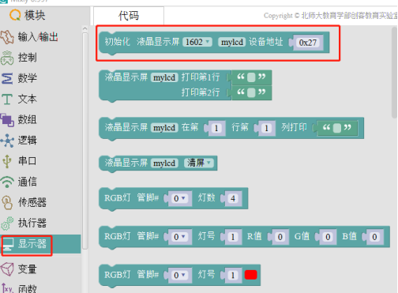

# LCD1602 显示屏

## 6.3.1 简介

LCD1602 显示屏是一款可用来显示字母、数字、符号等的点阵型液晶屏。该显示屏每行显示 16 个字符，一共可以显示两行，通过图形化编程可以将数字、英文字母以及符号显示到屏幕中，该显示屏不能显示汉字以及中文符号。LCD1602 显示屏模块通过 I2C 总线与主控板通信，所以该显示屏的 SCL 和 SDA 引脚需要连接到主控板的 A5 和 A4 端口。

注：

1、I2C 总线是一种简单的、双向二线制同步串行总线，只需要两根线即可在连接于总线上的器件之间传送信息。

连接到 I2C 总线上的器件都有一个唯一的识别地址。

## 6.3.2 LCD1602 显示屏在 Mixly 中使用示例

（1）打开 Mixly，在左侧模块栏选择 显示器 →初始化 液晶显示屏 1602，如图 5.3-1 所示。本示例中 LCD1602 显示屏在 I2C 总线上的地址为 0x27，程序模块中默认即可，不需要修改。

（2）在 Mixly 左侧模块栏选择 显示器 →液晶显示屏 －在第－行－第－列打印，如图 6.3-2 所示，在文本框内输入要打印的字符，如图 6.3-3 所示，示例中默认从显示屏的第一行第一列开始打印字符。

（3）按照图 6.3-4 所示连接以上模块，将 LCD1602 显示屏连接到主控板，上传程序到主控板，可观察到显示屏上显示出程序中设置的字符。

（4）LCD1602 还可以与传感器一起使用，显示传感器采集到的数据，按照图 5.3-5 所示连接程序，将温湿度传感器和LCD1602 显示屏连接到主控板，上传程序，可观察到显示屏上显示出当前环境的温湿度。

注：温湿度传感器的使用方法可参照本说明书中第四章节温湿度传感器的介绍。

（5）在 Mixly 示例程序文件中打开“LCD1602\_I2C 示例”，按示例程序引脚连接好硬件，上传程序到主控板，可观察到显示屏上显示的字符。

## 6.3.3 LCD1602 显示屏应用场景举例

LCD1602 是一种输出显示模块，该屏幕可以配合一些传感器一起使用，用于显示字符或者检测数据等。例如：温湿度显示器、电子表、体重秤。

