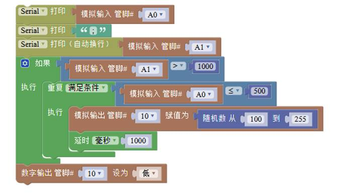

# 任务3——制作电子蜡烛

## 1、任务目标

首先打开Mixly的串口监视器，可以分别看到模拟声音传感器和模拟光线传感器检测到的声音强度值和光强值；当亮度暗时，蜡烛“点亮”，火苗闪烁，有吹蜡烛的声音的时候，蜡烛熄灭。

## 2、流程图

## 3、程序编程

## 4、硬件连接

硬件连接：LED ——10；模拟声音传感器——A0；模拟光线传感器——A1。注意插线时的颜色对应。

## 5、Q&A

Q：为什么程序中要设定光强大于1000时，在限定声音值小于500时，蜡烛开始闪烁？

A：光强大于1000的时刻，代表点蜡烛的瞬间，光线最强。

## 6、拓展

1、知识点总结

1）“随机数”程序块；

2）串口打印；

3）循环结构；

2、相关案例

1）本项目任务2和任务1；

