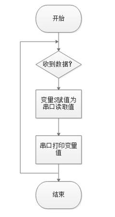
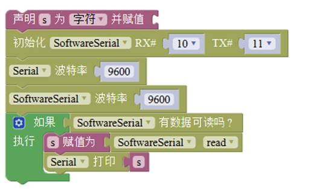
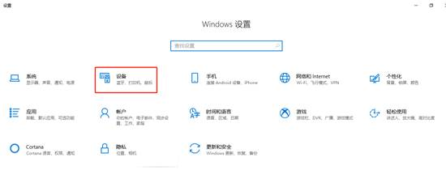
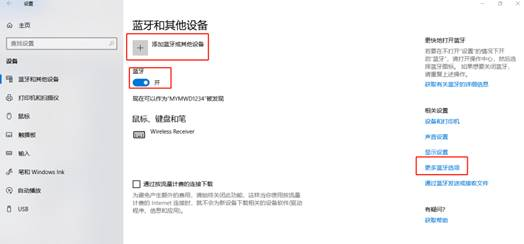
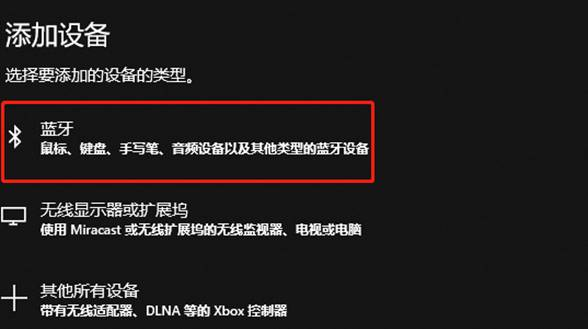
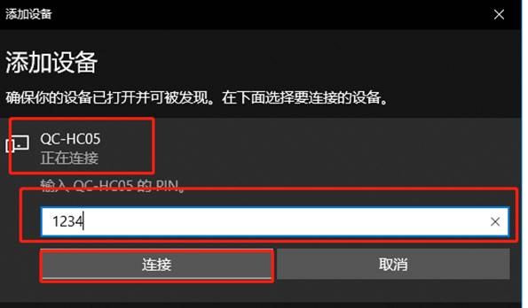
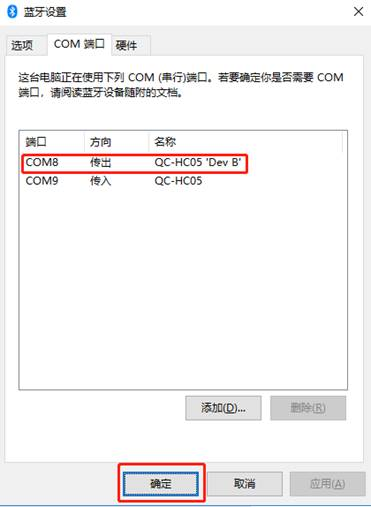

# 任务1——蓝牙与PC的数据传输

## 1、任务目标

HC-05蓝牙模块通过甜橙版与PC实现通信，可以通过串口调试助手观察结果。

## 2、流程图



## 3、程序编程



也可以用代码编程使用Arduino IDE来编程，代码如下：

```text
\#include <SoftwareSerial.h>

volatile char s;

SoftwareSerial mySerial(10,11);

void setup(){

  s = 0;

  Serial.begin(9600);

  mySerial.begin(9600);

}
void loop(){

  if (mySerial.available() > 0) {

​    s = mySerial.read();

​    Serial.print(s);

  }

}
```

## 4、硬件连接

### 1）甜橙与蓝牙的接线

蓝牙TX--甜橙D10；蓝牙RX---甜橙D11；蓝牙GND接甜橙黑色管脚；蓝牙VCC接甜橙红色管脚。

### 2）打开电脑蓝牙

首先打开电脑的 设置，如图3.13-3所示，点击设备--打开蓝牙，单击添加蓝牙或其他设备，如图3.13-4所示：





### 3）将PC蓝牙与蓝牙模块进行配对连接

A、点击“蓝牙”，如图3.13-5所示，进入添加设备页面，点击QC-HC05，进行配对连接，如图3.13-6所示，当出现如图3.13-7所示时，PC已经与蓝牙模块连接完成；

B、点击图3.13-4所示的“更多蓝牙选项”，单击“COM端口”如图3.13-8所示，观察传出端口，图中为COM8。








## 5、Q&A

Q：如何确定蓝牙进入AT模式？怎么退出AT模式？

A：蓝牙模块指示灯由2次/秒快速闪烁进入2秒/次的频率闪烁，表明蓝牙已进入AT模式。

设置完毕后，断开电源，再次通电，这时，蓝牙模块指示灯会快速闪烁，这表明蓝牙已经进入正常工作模式，两个模块会自动配对然后连接，状态灯会出现慢闪烁指示。

Q：蓝牙配对完成后，并没有收到发送的信号？

A：检查硬件接线，RX、TX是否已经交叉连接；查看蓝牙模块的工作状态，指示灯是否慢闪烁。

## 6、拓展

1、知识点总结

1）蓝牙模块的接线；

2）蓝牙AT模式的设置；

3）蓝牙与PC的配对与连接；

